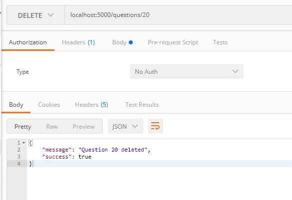
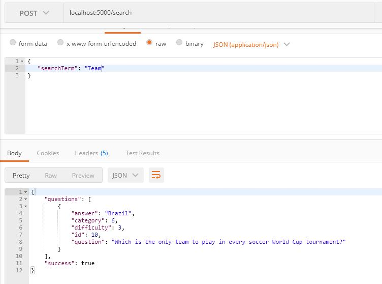

# API Development and Documentation Final Project

## Trivia App

Udacity is invested in creating bonding experiences for its employees and students. A bunch of team members got the idea to hold trivia on a regular basis and created a webpage to manage the trivia app and play the game, but their API experience is limited and still needs to be built out.

That's where you come in! Help them finish the trivia app so they can start holding trivia and seeing who's the most knowledgeable of the bunch. The application must:

1. Display questions - both all questions and by category. Questions should show the question, category and difficulty rating by default and can show/hide the answer.
2. Delete questions.
3. Add questions and require that they include question and answer text.
4. Search for questions based on a text query string.
5. Play the quiz game, randomizing either all questions or within a specific category.

Completing this trivia app will give you the ability to structure plan, implement, and test an API - skills essential for enabling your future applications to communicate with others.

## Getting Started
### Pre-requisit and Local Developement

## Starting and Submitting the Project

Click [here](https://github.com/Belinga-Belinga-Maximilien/cd0037-API-Development-and-Documentation-project) and fork the project repository and [clone](https://help.github.com/en/articles/cloning-a-repository) your forked repository to your machine. 

### About the Stack

We started the full stack application for you. It is designed with some key functional areas:

### Backend

From the backend folder we create a virtual enviroment to install the project dependencies

***install virtual environment***
```
pip install virtualenv
```

***setup virtual environment***
```
virtualenv env --python=3.7
```

***activate virtual environment***
```
source env/bin/activate
```

The [backend](./backend/README.md) directory contains a  completed Flask and SQLAlchemy server. To run the application backend we use the following commands within the backend directory

```
export FLASK_APP=flaskr
export FLASK_ENV=development
flask run
```

***Note!!!***

You need to first of all create a database and pre-populate the tables following the instructions on the [Backend README](./backend/README.md) 
> View the [Backend README](./backend/README.md) for more details.

### Frontend

The [frontend](./frontend/README.md) directory contains a complete React frontend to consume the data from the Flask server. 

From the frontend directory, run the following command to start the web client

***install dependencies**
```
npm install
```

***start web client***
```
npm start
```

Once started we can access on a browser [http://localhost:3000](http://localhost:3000)


> View the [Frontend README](./frontend/README.md) for more details.

## Tests
We can run tests on our application from the backend folder with the following commands.

```
dropdb trivia_test
createdb trivia_test
psql trivia_test < trivia.psql
python test_flaskr.py
```

## API Reference
### Getting Started
- Base URL: `http://localhost:5000/`, this endpoint will run locally and can be access by the local machine through a web client such as the the frontend or postman. Or by using the curl command.
- Authentication: No authentication is required for this endpoint

### Error Handling
errors are returned as JSON objects:
```json
{
    "success":False,
    "error":422,
    "message": "unresponsive"
}
```
We have the the following error handlers in our application
- 404: Resource Not Found
- 405: Method not found
- 422: Unresponsive

### Endpoints
#### GET /categories
- General:
    - Returns list of all categories
- Sample: `curl http://localhost:5000/categories`


#### GET /questions
- General: 
    - Returns a list of questions and all categories
    - can also handle paginations.
- `curl -X GET http://localhost:5000/questions`

- `curl -X GET http://localhost:5000/questions?page={pagenumber}`

#### POST /questions
- General:
    - Adds a new question to the database. Receives a json object as input 
- `curl -X GET http://localhost:5000/questions -d '{"question":"some question", "answer":"some answer", "difficulty":1, "category":3}'`
    - we must choose the category from an existing category
- From postman


#### DELETE /questions/{question_id'}
- General: 
    - Deletes a question of a given qhuestion_id if it exists. Returns a message and success value
- `curl -X DELETE http://localhost:5000/questions`
- From Postman


#### POST /search
- General:
    - Get questions based on a search term.Returns any questions for whom the search term is a substring of the question.
- From postman


#### GET /categories/id/questions
- General: 
    - Gets questions based on category.
    - Returns a list of questions under the same category
- From Postman


#### POST /quizzes
- General:
    - Get questions to play the quiz. This end point takes category and previous question parameters and returns a random questions within the given category, if provided, and that is not one of the previous questions.
- From Postman


## Deployment
- There are no deployments in this project
## Authors
- Belinga Maximilien
## Acknowledgements
I will like to acknowledge the Udacity Team for develoiping such an intersting project to boost the career of FullStack Web developers.
